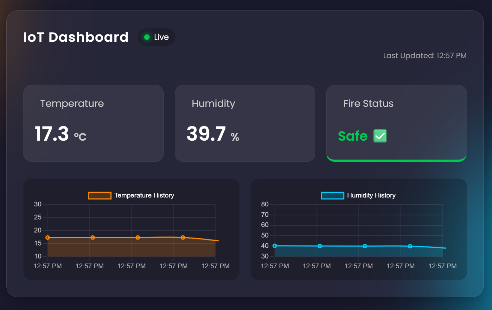
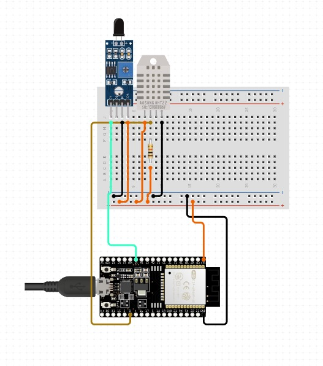

# 🛡️ IoT-Based Safety Module for Electric Heaters




## 📖 About
**IoT-Based Safety Module for Electric Heaters** is a real-time environmental monitoring system built for the **CE491 Graduation Project**. It detects fire hazards, monitors temperature/humidity, and syncs data instantly to a web dashboard, Telegram, and Google Sheets.

## ✨ Features
* **🔥 Fire Detection:** Immediate alerts via Flame Sensor.
* **📊 Web Dashboard:** Real-time monitoring with historical charts (Glassmorphism UI).
* **📱 Telegram Alerts:** Push notifications for critical events (Fire, High Temp).
* **☁️ Dual Cloud Logging:**
    * **Firebase:** For real-time dashboard sync.
    * **Google Sheets:** For long-term history logging.

## 🏗️ System Architecture
This diagram illustrates the high-level communication between the ESP32, sensors, and the cloud platforms (Firebase, Telegram, Google Sheets).


## 🛠️ Hardware
* **ESP32 DevKit V1**
* **DHT22 Sensor** (Pin D27)
* **IR Flame Sensor** (Pin D14)



## ⚙️ System Logic
This flowchart illustrates how the system manages sensors, connectivity, and decision-making (Main loop).


## 🚀 Setup & Configuration

### 1. Hardware & Code Setup
1. Clone the repo and open in **VS Code** with **PlatformIO**.
2. **Rename Config File:**
   * Go to `include/` folder.
   * Rename `config_example.h` to `config.h`.
   * Open `config.h` and fill in your details:
     * WiFi Credentials.
     * Firebase API Key & URL.
     * Telegram Bot Token & Chat ID.
     * Google Script URL.

### 2. Dashboard Setup (Frontend)
1. Go to `data/` folder.
2. Open `script.js`.
3. Locate the **Firebase Configuration** section at the top.
4. Replace the placeholder values with your own Firebase Web App config keys.

### 3. Uploading
1. Connect ESP32 via USB.
2. Upload the **Firmware** (Code) via PlatformIO (➡️ button).
3. Upload the **Filesystem Image** (to save HTML/CSS to ESP32).
4. Monitor output at Baud Rate **115200**.

## 📂 Project Structure

```text
ESP32_Project/
├── .pio/                  # PlatformIO build files
├── data/                  # Web Dashboard Files (Uploaded to SPIFFS/LittleFS)
│   ├── index.html         # Main Dashboard Interface
│   ├── style.css          # Styling & Animations
│   └── script.js          # Logic & Firebase Integration (Edit Config Here!)
├── include/               # Header Files
│   ├── cloud_manager.h    # Google Sheets handling
│   ├── config.h           # Sensitive Config (Renamed from config_example.h)
│   ├── firebase_manager.h # Firebase RTDB handling
│   ├── sensor_manager.h   # DHT & Flame sensor logic
│   └── telegram_manager.h # Bot alerts handling
├── src/                   # Source Code
│   ├── main.cpp           # Main loop & System orchestration
│   ├── cloud_manager.cpp
│   ├── firebase_manager.cpp
│   ├── sensor_manager.cpp
│   └── telegram_manager.cpp
├── platformio.ini         # Project Dependencies & Settings
└── README.md              # Documentation
```

## 🎥 Live Demo
Click the image below to watch the system in action:

[](https://youtube.com/shorts/E3eaTCnOFkE?si=o2KrPO3ONYSjpmWO)
